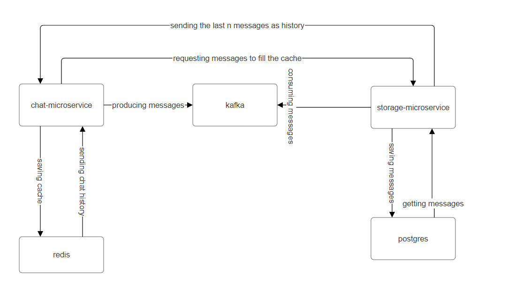

[](https://classroom.github.com/a/kF9GUL1O)
# 2024-spring-AB-Go-HW-3-

## How to get started
1. Run docker-compose
```bash
docker-compose up --build
```
2. Run migrations
```bash
cd ./storage-microservice
make migrate-up
```
3. Run client
```bash
cd ./chat-microservice
make runClient
```

## Application structure

